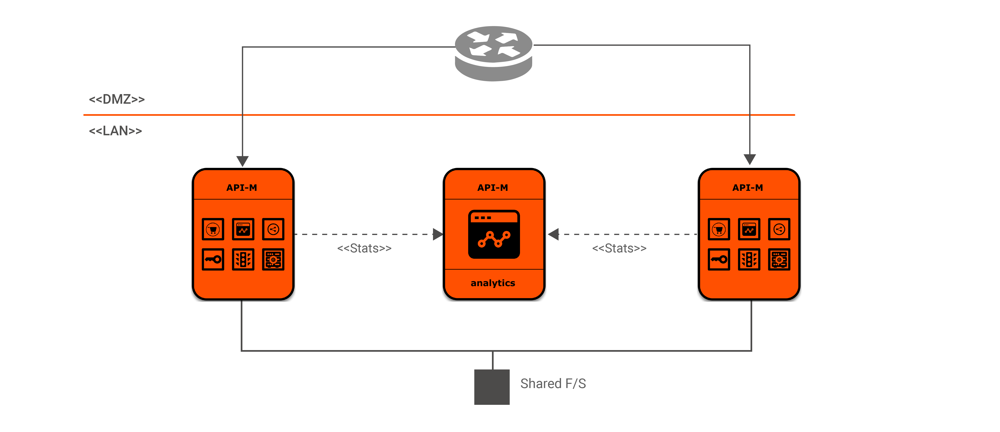

# Openshift resources of WSO2 API Manager with WSO2 API Manager Analytics

## Contents

* [Prerequisites](#prerequisites)
* [Quick Start Guide](#quick-start-guide)

## Prerequisites

1. An already setup OpenShift cluster

2. Seven NFS shares for storage. For a step by step guide on how to install NFS server refer here. [CentOS](https://www.server-world.info/en/note?os=CentOS_7&p=nfs&f=1), [Ubuntu](https://www.server-world.info/en/note?os=Ubuntu_18.04&p=nfs&f=1)

## Quick Start Guide

1. Create an OpenShift project name `wso2`.

	`oc new-project wso2`

2. Add your subscription details

	`oc create secret docker-registry wso2-image-pull-secret --docker-server=docker.wso2.com --docker-username=<SUBSCRIPTION_USERNAME> --docker-password=<SUBSCRIPTION_PASSWORD>`

3. Deploy WSO2 APIM Server using the Template.yaml

	`oc process -f Template.yaml -p NFS_SERVER_IP=<NFS_SERVER_IP> -p NFS_SHARE_DATABASE=<DATABASE_NFS_SHARE_PATH> -p NFS_SHARE_SYNAPSE=<SYNAPSE_NFS_SHARE_PATH> -p NFS_SHARE_EXECUTION_PLANS=<EXECUTION_PLANS_SHARE_PATH> -p NFS_SHARE_CARBON_DB_1=<CARBON_DB_1_NFS_SHARE_PATH> -p NFS_SHARE_SOLR_1=<SOLR_1_NFS_SHARE_PATH> -p NFS_SHARE_CARBON_DB_2=<CARBON_DB_2_NFS_SHARE_PATH> -p NFS_SHARE_SOLR_2=<SOLR_2_NFS_SHARE_PATH> -p OPENSHIFT_BASE_DOMAIN=<OPENSHIFT_URL> | oc create -f -`

4. Access product management consoles. Obtain the (HOST/PORT) of the route resource

	`oc get route -n <PROJECT_NAME>`
	
Try navigating to `https://<HOST/PORT>/carbon`, `https://<HOST/PORT>/publisher` and `https://<HOST/PORT>/devportal` from your favorite browser.

## Configuration
The following tables lists the configurable parameters of the template and their default values.
| Parameter                                                                   | Description                                                                               | Default Value               |
|-----------------------------------------------------------------------------|-------------------------------------------------------------------------------------------|-----------------------------|
| `OPENSHIFT_PROJECT_NAME`                                                | Name of the OpenShift project                                                           | wso2                          |
|`OPENSHIFT_BASE_DOMAIN`|OpenShift base domain|`required`
|`IMAGE_ANALYTICS_WORKER`|WSO2 Analytics Worker image name|docker.wso2.com/wso2am-analytics-worker:3.1.0|
|`IMAGE_ANALYTICS_DASHBOARD`|WSO2 Analytics dashboard image name|docker.wso2.com/wso2am-analytics-dashboard:3.1.0|
|`IMAGE_APIM`|WSO2 APIM image name|docker.wso2.com/wso2am:3.1.0|
|`IMAGE_PULL_SECRET`|WSO2 Subscription Credentials|wso2-image-pull-secret|
|`NFS_SERVER_IP`|NFS Server IP address|`required`|
|`NFS_SHARE_DATABASE`|NFS Share Path for database|`required`|
|`NFS_SHARE_SYNAPSE`|NFS Share Path for synapse configs|`required`|
|`NFS_SHARE_EXECUTION_PLANS`|NFS Share Path for executionplans|`required`|
|`NFS_SHARE_CARBON_DB_1`|NFS Share Path for instance 1 carbon database|`required`|
|`NFS_SHARE_SOLR_1`|NFS Share Path for instance 1 solr index|`required`|
|`NFS_SHARE_CARBON_DB_2`|NFS Share Path for instance 2 carbon database|`required`|
|`NFS_SHARE_SOLR_2`|NFS Share Path for instance 2 solr index|`required`|
|`RESOURCES_LIMITS_CPU`|Set a CPU resource limits for apim|3000m|
|`RESOURCES_LIMITS_MEMORY`|Set a memory resource limits limits for apim|3Gi|
|`RESOURCES_REQUEST_CPU`|Set a minimum CPU resource limits limits for apim|2000m|
|`RESOURCES_REQUEST_MEMORY`|Set a minimum memory resource limits limits for apim|2Gi|
|`RESOURCES_LIMITS_CPU_ANALYTICS_WORKER`|Set a CPU resource limits for analytics worker|2000m|
|`RESOURCES_LIMITS_MEMORY_ANALYTICS_WORKER`|Set a memory resource limits for analytics worker|4Gi|
|`RESOURCES_REQUEST_CPU_ANALYTICS_WORKER`|Set a minimum CPU resource limits for analytics worker|2000m|
|`RESOURCES_REQUEST_MEMORY_ANALYTICS_WORKER`|Set a minimum memory resource limits for analytics worker|4Gi|
|`RESOURCES_LIMITS_CPU_ANALYTICS_DASHBOARD`|Set a CPU resource limits for analytics dashboard|2000m|
|`RESOURCES_LIMITS_MEMORY_ANALYTICS_DASHBOARD`|Set a memory resource limits for analytics dashboard|4Gi|
|`RESOURCES_REQUEST_CPU_ANALYTICS_DASHBOARD`|Set a minimum CPU resource limits for analytics dashboard|2000m|
|`RESOURCES_REQUEST_MEMORY_ANALYTICS_DASHBOARD`|Set a minimum memory resource limits for analytics dashboard|4Gi|
